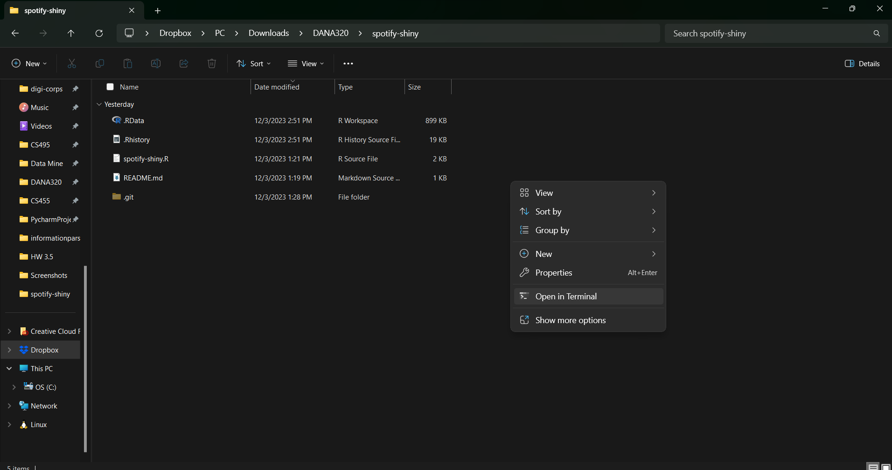

# spotify-shiny

## Git Flow
- open a terminal in the project folder, called spotify-shiny
- on Windows, you can do this by opening the spotify-shiny folder in the file explorer, right click, and select `Open in Terminal`, as shown below.

- when you open the project to work on it, run `git pull`
- when you get something working, run `git add -a`
- run `git commit -m "<write a descriptive message>"`
- run `git push`
- repeat these steps before you close the file
- if you follow these steps every time, there should hopefully be no problems
